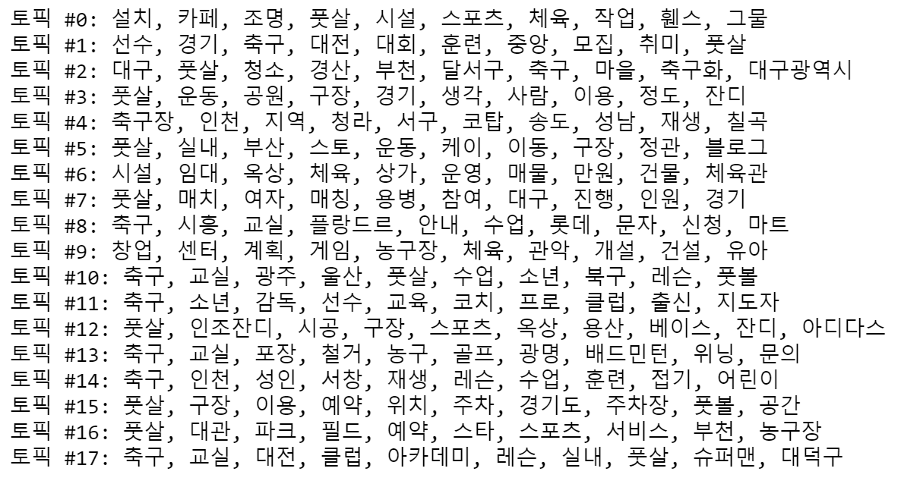

# Urban-Sport-Field-Keyword-Analysis

#### 1. Web Scraping with Selenium & REST API(Naver API)
#### 2. Text Classification with Bi-directional LSTM
#### 3. LDA Topic Modeling

## Goal of the project
1. Figure out keywords or topic from review of urban sport field in major cities in Korea.
2. Scrap more than 10k data with REST API, and make the automated scrapping process.
3. Use various text analysis modeling method.

## Packages/Library used

**Mainly**
<table>
<tbody>
    <tr>
        <td width="60">
            
 Python3 

        </td>
        <td>
            
 Jupyter Notebook 

        </td>
        <td>
            
 Scikit-Learn(LDA) 

        </td>
</tbody>
</table>

**Web Scraping**
<table>
<tbody>
    <tr>
        <td width="60">
            
 Selenium 

        </td>
        <td>
            
 Beatiful Soup 

        </td>
        <td>
            
 Naver API 

        </td>
</tbody>
</table>

**Text Classification - Bidirectioanl LSTM, Vanilla LSTM**
<table>
<tbody>
    <tr>
        <td width="60">
            
 TensorFlow 

        </td>
        <td>
            
 Keras 

        </td>
        <td>
            
 Scikit-Learn(CountVectorizer) 

        </td>
</tbody>
</table>

**Text Preprocessing**

<table>
<tbody>
    <tr>
        <td width="60">
            
 Konlpy 

        </td>
        <td>
            
 Pykospacing 

        </td>
</tbody>
</table>

## 1. Web Scraping with Selenium & REST API(Naver API)
- I Scraped 10k data from Naver Blog when searched for 'Sport field'
- You can manually input any query. Than you can get 1100 data at once. But it takes some time (about 10+ min)
- It is impossible to get More than 1100 data due to the Naver API policy. If you want so, you can use Beatiful Soup or else.
- Now is cleansing time. There are so many HTML/CSS tags and special chars. I made four function, so you can easily do cleansing.

## 2. Text Classification with Bi-directional LSTM
- When you check the df that you've just got at the last step, you can find that many irrelevant data to reviews. So we have to classify it.
- It's a similar to spam mail classification. **So I used RNN**.
- But It showed 

## 3. LDA Topic Modeling
- I did LDA topic modeling to figure out topics and keywords from corpus of reviews.
- First, I tokenized and lemmatized contents of all reviews. And vertorized them.
- Second, I made a function that shows confusion by number of topics just like the png below.

- So we can see that **18 topics** are the best.

## Result

- Interpretation of topics may vary depending on what meaning the user is looking for.

